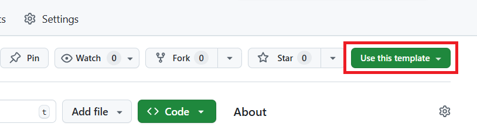

# 20251008my-app

最新情報掲示板を提供する Next.js プロジェクトです。管理者が投稿すると、トップページに最新のお知らせが表示され、一般ユーザーはアーカイブも確認できます。

## 必要なもの
- GitHub アカウント
- Node.js 18 以上と npm（`node -v`, `npm -v` で確認）
- Git（ローカルで編集・コミットする場合）
- Vercel アカウント（本番公開用）

## テンプレートから自分のリポジトリを作成する
1. ブラウザで [bazaarjapan/20251008my-app](https://github.com/bazaarjapan/20251008my-app) を開きます。
2. 画面右上付近の **Use this template** ボタンをクリックします。  
   
3. 表示されたフォームで以下を設定します。
   - **Owner**: 自分のアカウントまたは所属組織
   - **Repository name**: 任意の名前（例: `my-company-announcements`）
   - 必要に応じて説明文を追加
4. **Create repository from template** を押すと、自分名義のリポジトリが作成されます。
5. ローカルで作業する場合は作成したリポジトリをクローンします。
   ```bash
   git clone https://github.com/<your-account>/<your-repo>.git
   cd <your-repo>
   ```

## GitHub Codespaces で編集する場合
ブラウザだけで開発できるので、ローカル環境構築が難しい場合はこちらが便利です。

1. 自分のリポジトリのトップページで **Code** ボタン→「Codespaces」タブ→**Create codespace on main** を選択します。
2. ブラウザ上の VS Code が起動し、自動で依存関係がインストールされます（初回は少し時間がかかります）。
3. ターミナルで `npm run dev` を実行するとプレビュー URL が発行され、掲示板を確認できます。
4. `.env.local` は Codespaces 上で作成可能です。エクスプローラーで「New File」→ `.env.local` を作成し、`ADMIN_TOKEN=your-secret-token` を追加します。
5. 変更ができたら Git タブからコミットし、`main` へ push するか Pull Request を作成してください。

## ローカル環境のセットアップ
1. 依存関係をインストールします。
   ```bash
   npm install
   ```
2. 管理者トークンを設定するため、プロジェクト直下に `.env.local` を作り次の内容を追加します。
   ```env
   ADMIN_TOKEN=your-secret-token
   ```
   > この値は管理者ページで投稿する際に入力するパスワードです。推測されにくい文字列を使ってください。
3. 開発サーバーを起動し、ブラウザで http://localhost:3000 を開きます。
   ```bash
   npm run dev
   ```
4. 投稿テスト  
   - 管理者ページ: http://localhost:3000/admin/announcements  
   - トークン欄に `.env.local` の `ADMIN_TOKEN` を入力し、お知らせを投稿  
   - トップページと http://localhost:3000/announcements を確認し、表示されるかチェックします。

## プロジェクト構成の概要
- `app/` — App Router ルート。`page.tsx` がトップページ、`announcements/page.tsx` がアーカイブ、`admin/announcements/page.tsx` が管理画面です。
- `app/api/announcements` — 一般公開用 GET API。
- `app/api/admin/announcements` — Bearer トークン必須の POST API。
- `lib/announcements.ts` — JSON ファイルを読み書きするヘルパー。
- `data/announcements.json` — お知らせの保存先。バックアップをおすすめします。
- `vercel.json` — Vercel 用ビルド設定と環境変数のマッピング。

## Vercel での自動 CI/CD デプロイ手順
1. **GitHub を連携**  
   Vercel ダッシュボードで「New Project」→「Import Git Repository」を選択し、先ほど作成したリポジトリを選びます。
2. **環境変数を設定**  
   - Project Settings → Environment Variables で `ADMIN_TOKEN` を追加し、秘密のトークンを設定します。  
   - 併せて Vercel KV（無料枠あり）をプロジェクトに連携し、`KV_REST_API_URL` / `KV_REST_API_TOKEN` / `KV_REST_API_READ_ONLY_TOKEN` を登録してください。これらが未設定の場合、本番環境ではデータが保持されません。
3. **ビルド設定の確認**  
   `vercel.json` により `npm install` → `npm run build` → `.vercel/output` という設定が自動で反映されます。変更が必要なければそのまま保存します。
4. **初回デプロイ**  
   「Deploy」ボタンを押すと、Vercel がビルドを実行し本番 URL を発行します。エラーが出た場合はログを確認し、環境変数の設定漏れなどをチェックしてください。
5. **以後の運用**  
   GitHub の `main` ブランチへ push するたびに自動でビルド・デプロイ（CI/CD）が走ります。Pull Request を作成するとプレビュー用 URL も生成されるので、レビュー時の確認に利用できます。

## トラブルシューティング
- **管理者ページで 401 Unauthorized**  
  → `ADMIN_TOKEN` の値と入力が一致しているか、Vercel では環境変数が本番／プレビュー両方に設定されているか確認してください。
- **ビルドが失敗する**  
  → Node.js バージョンが 18 以上か、`npm run lint` によるエラーがないかをローカルで確認してください。
- **掲示内容をリセットしたい**  
  → `data/announcements.json` を空の配列 `[]` に書き換え、アプリを再起動します。重要データは事前にバックアップしてください。

困った時は Issue を作成するか、リポジトリ管理者までお気軽に連絡してください。
